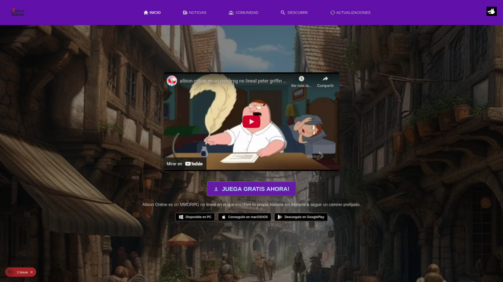
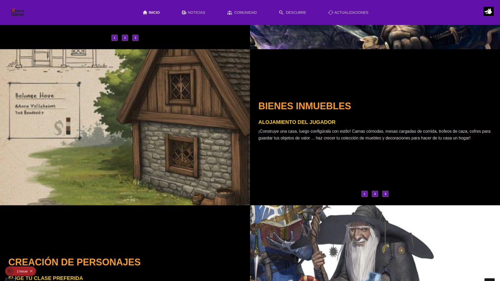
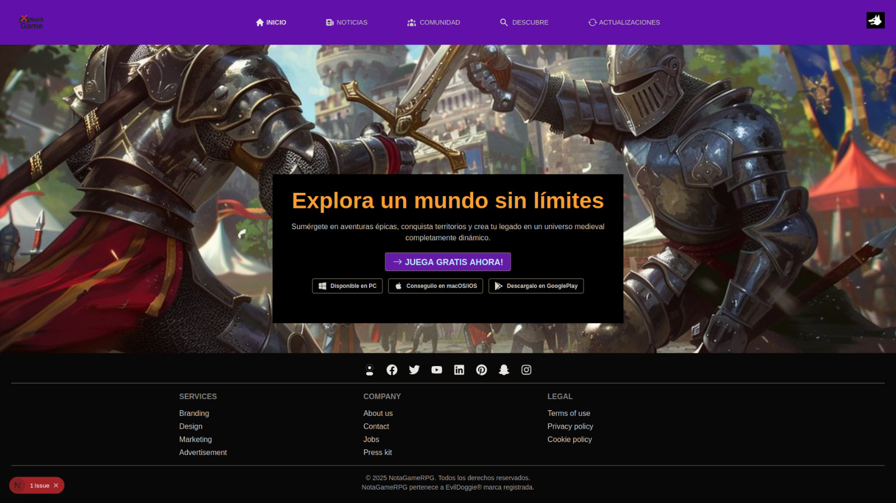

# INTEGRANTES
. Bressan Nadal Franco Nicolas (fbressan-itec)
 
. Odetto Leandro (leandroitec)

# Enlaces del Proyecto FlaskAPI
https://github.com/leandroitec/efiFInalPython

# INTRODUCCION

En la materia de Programación II desarrollamos una página temática inspirada en un juego MMORPG online usando DaisyUI y React.
En Python, creamos una API con Flask que maneja posteos, comentarios y autenticación por roles.
En Java, planeamos aprovechar el EFI para construir un frontend de la API y un foro para la página de programación.

# INSTRUCCIONES DE INSTALACION (luego de FlaskAPI)
0. Ten instalado node en una version superior al 20, para verificar ($ node -v), si no lo tienes sigue la guia de instalacion de https://nodejs.org/
1. Clonar el repositorio ssh ($ git clone git@github.com:fbressan-itec/jsII.efi_final.git)
2. cd /jsII.efi_final
3. Instalar dependencias ($ npm install)
4. Correr las dos apps. En la terminal de efiFinalPython (uv run flask run --reload) y en la de jsII.efi_final (npm run dev)
5. Abrir http://localhost:5173 

# COMANDOS/EJECUCION

1. Iniciar API __uv run flask run --reload__
2. Correr pagina __npm run dev__

# ENLACES A PROYECTOS RELACIONADOS

1. Pagina NotaGame (EFI programacionII): https://github.com/fbressan-itec/progII.Reto4
2. FlaskAPI (EFI python): https://github.com/leandroitec/efiFInalPython

# REFERENCIAS: PAGINA PRINCIPAL (EFI programacion2)
 
 
 

------------------------------------------------------------------
## COMENTARIOS INTERNOS DEL GRUPO
1. Agregue en Json "engines" la version de node.js, esto es para que salga advertencia si tenemos la version de node que usamos en el efi de programacionII, que es mas vieja y vite no lo soporta. Si sale error simplemente cambiar la version a 20.19.0 o superior (Ej: nvm use 22.18.0)
2. Cree el Home con estilos css y los colores del efi de programacion 2, falta loguin y seguimos cada uno en su rama.
3. Los css de Login y Registro hay que cambiarlos siguiendo la tematica del Home
4. Agregar al Login para elegir un rol (hacer logica, token decoder)
5. Ver de usar mas Prime react, yo hice css muy personalizado

#### Requisitos:
##### ~~Autenticación y Usuarios~~

1. ~~Implementar un formulario de registro con los campos: name, email, password y rol (seleccionable desde un menú desplegable).~~
2. ~~Implementar un formulario de inicio de sesión (login) que obtenga un JWT desde la API y lo almacene en localStorage.~~
3. ~~Decodificar el token (por ejemplo, usando la librería jwt-decode) para obtener datos como el nombre, email, rol y fecha de expiración.~~
4. ~~Gestionar la sesión del usuario mediante un contexto global (AuthContext).~~
5. ~~Permitir cerrar sesión (logout) y limpiar el estado del usuario.~~

##### ~~CRUDs Principales~~
 
 1. Posts: ~~crear, listar, editar y eliminar publicaciones. Cada post debe incluir al menos un  título, contenido, autor y fecha~~

 2. Reviews: ~~crear, listar, editar y eliminar reseñas o comentarios. Las reviews pueden estar asociadas a un post según la API~~.

##### ~~Seguridad y Roles~~

1. ~~Proteger las rutas privadas mediante la validación del token JWT.~~

2. ~~Implementar diferenciación de permisos por rol, por ejemplo:~~ ~~Usuarios con rol admin pueden acceder a ciertas secciones o funcionalidades exclusivas.~~ ~~Usuarios con rol user solo pueden gestionar sus propios posts o comentarios.~~

##### ~~Interfaz de Usuario:~~ 

1. ~~PrimeReact~~
2. ~~La aplicación debe ser responsive~~ (~~Formularios validados y mensajes de error~~. ~~Botones y elementos visuales consistentes.~~ ~~Toasts o alertas para mostrar mensajes de éxito o error.~~ ~~Navegación clara con barra superior (navbar) y enlaces visibles según el rol del usuario.~~)

